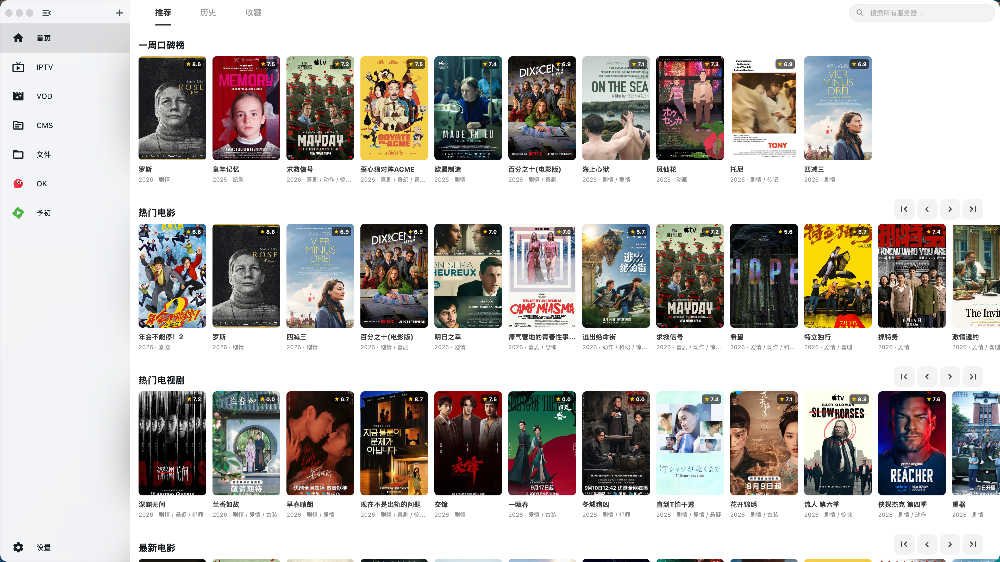
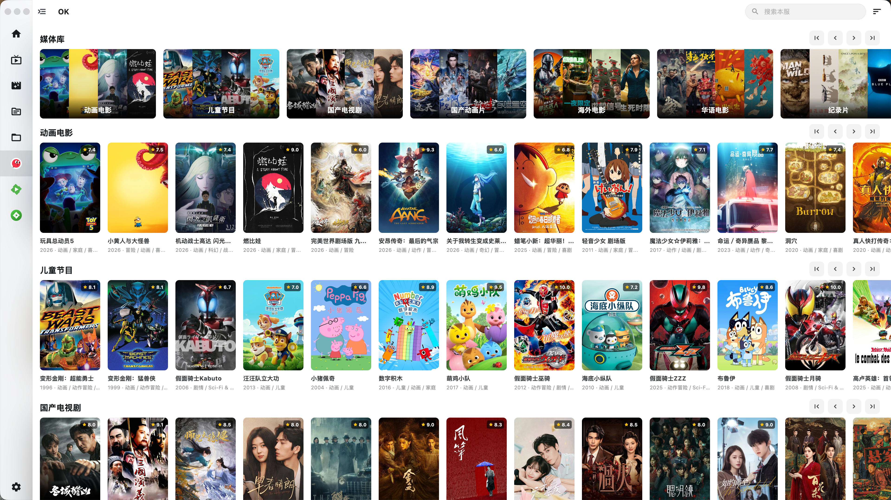
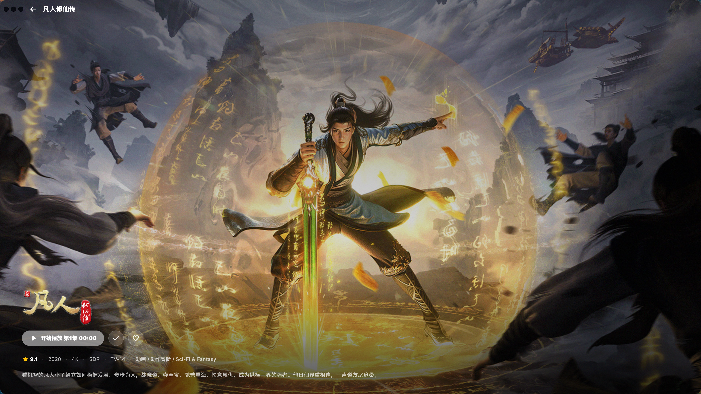
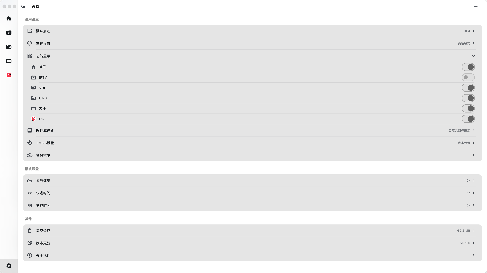

# FeiPlayer

一款现代化、全功能全平台多媒体聚合播放器。

## 📖 项目简介

**FeiPlayer** 致力于为用户提供一个统一、流畅且高度可定制的多媒体观看平台。它不仅是一个视频播放器，更是一个个人媒体中心，将分散的直播、点播、私有云和本地资源无缝连接在一起。

FeiPlayer 将提供全平台的支持，在移动端和桌面端实现了高度一致的操作逻辑和优美的视觉体验。

## ✨ 核心功能

-   **🎬 多源媒体聚合**
    -   **IPTV 支持**：内置完善的 IPTV 逻辑，支持获取节目单 (EPG)、频道分类管理及自动播放。
    -   **媒体服务器集成**：深度对接 **Emby** 与 **Jellyfin**，轻松播放私有媒体库内容。
    -   **视频点播 (VOD)**：支持集成 CMS 类视频点播系统。
-   **📺 卓越的播放体验**
    -   **高性能内核**：支持全格式硬解码及流畅播放。
    -   **弹幕系统**：内置弹幕渲染引擎，支持自定义弹幕 API 接口，提供密度、速度调节及关键词屏蔽功能。
    -   **字幕处理**：具备强大的字幕解析能力，包括对 PGS 等图形字幕的支持。
    -   **精准控制**：支持自定义倍速播放、可调跨度的快进/快退步长。
-   **🛠️ 高度自由的定制化**
    -   **界面个性化**：支持深/浅色主题切换，侧边栏导航项可根据需求自由排序或隐藏。
    -   **资源扩展**：支持通过外部 URL 加载图标库，并提供代理加速功能优化资源加载。

## 💬 交流群
　　　Telegram：[FeiPlayer交流群](https://t.me/feiplayer_chat)  

## 💡 界面展示

## 🥳 投喂通道

    &nbsp;&nbsp;&nbsp;&nbsp;&nbsp;&nbsp;&nbsp;&nbsp;&nbsp;&nbsp;&nbsp;&nbsp;
    通过微信投喂
    &nbsp;&nbsp;&nbsp;&nbsp;&nbsp;&nbsp;&nbsp;&nbsp;&nbsp;&nbsp;&nbsp;&nbsp;&nbsp;&nbsp;&nbsp;&nbsp;&nbsp;&nbsp;&nbsp;&nbsp;&nbsp;&nbsp;&nbsp;&nbsp;&nbsp;&nbsp;&nbsp;&nbsp;&nbsp;&nbsp;&nbsp;&nbsp;
    通过支付宝投喂
     
    
    
    

---

*由 FeiPlayer 团队倾情打造。*
